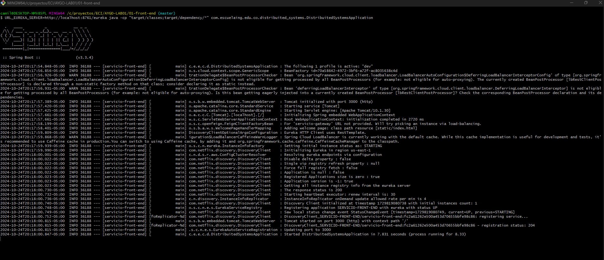
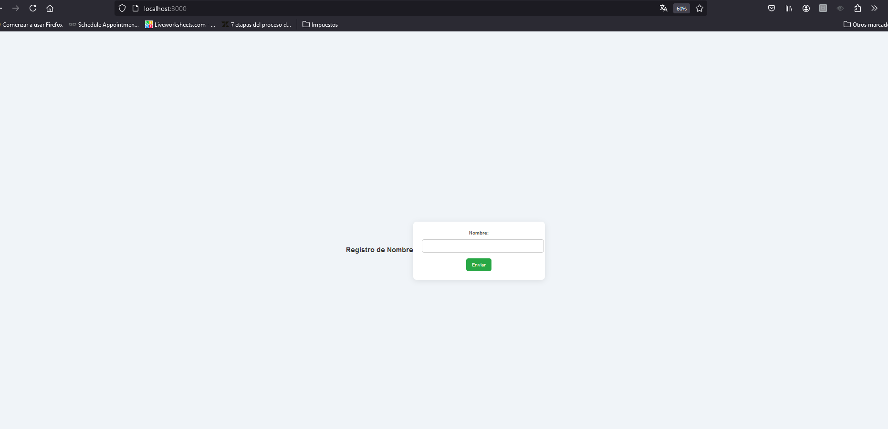

# Manual de Ejecución para Compilar un Proyecto Maven Front-End

Este manual explica cómo compilar y ejecutar un proyecto Maven en Java, configurando una variable de entorno (`URL_EUREKA_SERVER`) en la ejecución.


## Paso 1: Clonar o Acceder al Proyecto

Si aún no tienes el proyecto en tu máquina, clónalo o navega al directorio del proyecto. Usa el siguiente comando para clonar desde un repositorio (reemplaza `<repository-url>` con la URL de tu repositorio):

```bash
git clone https://github.com/Rincon10/AYGO-LAB01.git
cd 01-front-end
```

## Paso 2: Compilar el Proyecto con Maven

n el directorio raíz del proyecto, ejecuta el siguiente comando 

```bash
mvn clean install
```

### Paso 3: Comandos para ejecutar la aplicacion 

>[!IMPORTANT]
Para que el proyecto se inicie correctamente sin ninguna excepción, es necesario iniciar primero el servicio de discovery. Esto permite que los diferentes servicios sepan a qué URL hacer las solicitudes. En caso de que no esté en ejecución, consulta el siguiente README.

Para ejecutar el proyecto y establecer la variable de entorno URL_EUREKA_SERVER, usa el siguiente comando:

### Windows


```bash
URL_EUREKA_SERVER=http://localhost:8761/eureka java -cp "target/classes;target/dependency/*" com.escuelaing.edu.co.distribuited_systems.DistribuitedSystemsApplication
```

### Linux

```bash
URL_EUREKA_SERVER=http://localhost:8761/eureka java -cp "target/classes:target/dependency/*" com.escuelaing.edu.co.distribuited_systems.DistribuitedSystemsApplication
```

si, todo ejecuta de manera correcta deberia ver el siguiente log



y si accedemos a el puerto 3000, veremos el front end 



## Manual de creacion de imagen docker

Usando la herramienta de línea de comandos de Docker construya la imagen:
### Comandos Docker

```bash 
docker build --tag docker-hello-image .
```

iniciando contenedor
```bash
docker run -d -p 34000:33025 --name firstdockercontainer docker-hello-image`
```
