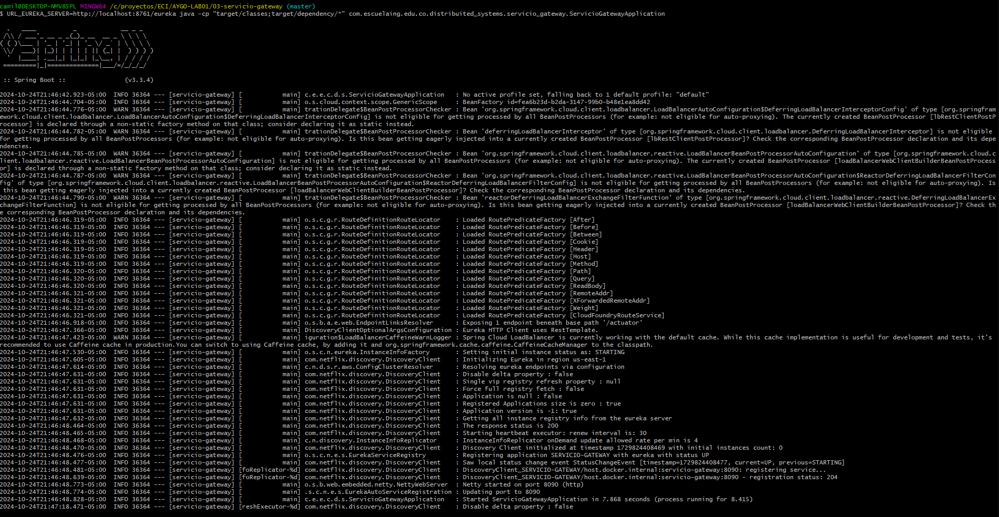
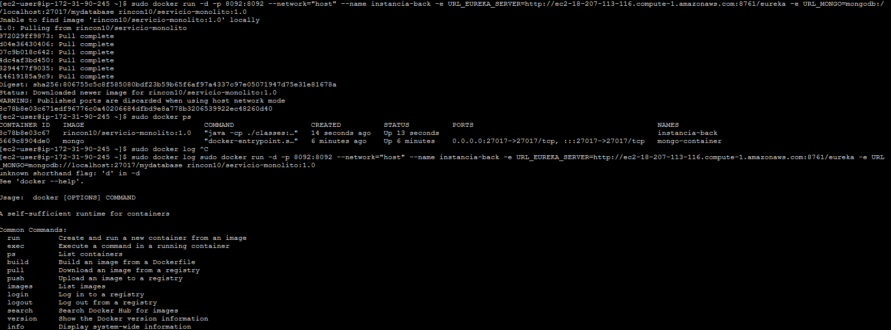
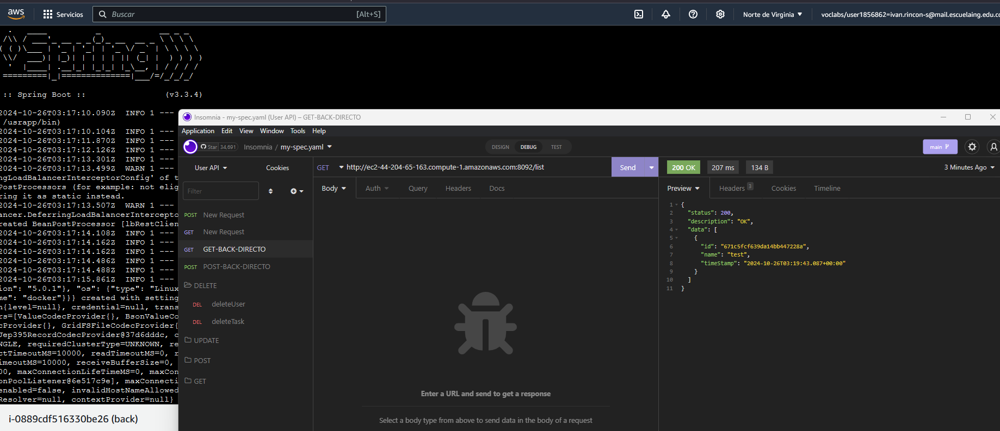

# Manual para Compilar y Ejecutar el monolito

Este manual te guiará para compilar y ejecutar el servicio monolito propuesto

## Paso 1: Clonar o Acceder al Proyecto

Si aún no tienes el proyecto en tu máquina, clónalo o navega al directorio del proyecto. Usa el siguiente comando para clonar desde un repositorio (reemplaza `<repository-url>` con la URL de tu repositorio):

```bash
git clone https://github.com/Rincon10/AYGO-LAB01.git
cd 04-servicio-monolito
```

## Paso 2: Compilar el Proyecto con Maven

n el directorio raíz del proyecto, ejecuta el siguiente comando

```bash
mvn clean install -DskipTests
```

### Paso 3: Comandos para ejecutar la aplicacion

>[!IMPORTANT]
Para que el proyecto se inicie correctamente sin ninguna excepción, es necesario iniciar primero el servicio de discovery. Esto permite que los diferentes servicios sepan a qué URL hacer las solicitudes. En caso de que no esté en ejecución, consulta el siguiente [README](../02-servicio-eureka-server/README.md), hacemos la suposicion que tiene configurada una db de mongo.

Para ejecutar el proyecto usa el siguiente comando:

### Windows


```bash
URL_EUREKA_SERVER=http://localhost:8761/eureka URL_MONGO=mongodb://localhost:27017/mydatabase java -cp "target/classes;target/dependency/*" com.escuelaing.edu.co.distribuited_systems.user.UserApplication
```

### Linux

```bash
URL_EUREKA_SERVER=http://localhost:8761/eureka URL_MONGO=mongodb://localhost:27017/mydatabase java -cp "target/classes:target/dependency/*" com.escuelaing.edu.co.distribuited_systems.user.UserApplication
```

si, todo ejecuta de manera correcta deberia ver el siguiente log

](../docs/img/12-mono-cmd.png)


## Manual de creacion de imagen docker

vamos a crear la imagen docker:
### Comandos Docker


### windows
```bash 
URL_EUREKA_SERVER=http://host.docker.internal:8761/eureka URL_MONGO=mongodb://host.docker.internal:27017/mydatabase TAG_VERSION=1.0 docker-compose up --build
```

### linux
```bash 
URL_EUREKA_SERVER=http://localhost:8761/eureka URL_MONGO=mongodb://localhost:27017/mydatabase TAG_VERSION=1.0 docker-compose up --build
```

para iniciar la imagen ejecutamos

```bash
docker run -d --name instancia-back-end rincon10/servicio-monolito:1.0
```


### publicando la imagen

Para publicar la imagen en Docker Hub, sigue estos pasos:

```bash
docker login
```

y luego

```bash
docker push rincon10/servicio-monolito:1.0
```

### Configuracion en AWS

1. Acceda a la máquina virtual
2. Instale Docker

```bash
sudo yum update -y
sudo yum install docker
```
3. Inicie el servicio de docker

```bash
sudo service docker start
```
4. Configure su usuario en el grupo de docker para no tener que ingresar “sudo” cada vez que invoca un comando

```bash
sudo usermod -a -G docker ec2-user
```

5. Desconectese de la máquina virtual e ingrese nuevamente para que la configuración de grupos de usuarios tenga efecto.
6. A partir de la imagen creada en Dockerhub cree una instancia de un contenedor docker independiente de la consola (opción “-d”) y con el puerto 6000 enlazado a un puerto físico de su máquina (opción -p):


```bash
sudo docker run -d -p 8092:8092 --network="host" --name instancia-back -e URL_EUREKA_SERVER=http://ec2-18-207-113-116.compute-1.amazonaws.com:8761/eureka -e URL_MONGO=mongodb://localhost:27017/mydatabase rincon10/servicio-monolito:1.0
```

7. Abra los puertos de entrada del security group de la máxima virtual para acceder al servicio

en nuestro caso la url que se expone es el siguiente http://ec2-3-80-71-218.compute-1.amazonaws.com, si todo sale bien podra acceder a la instancia de aws, como se deberia ver como en la siguiente imagen






