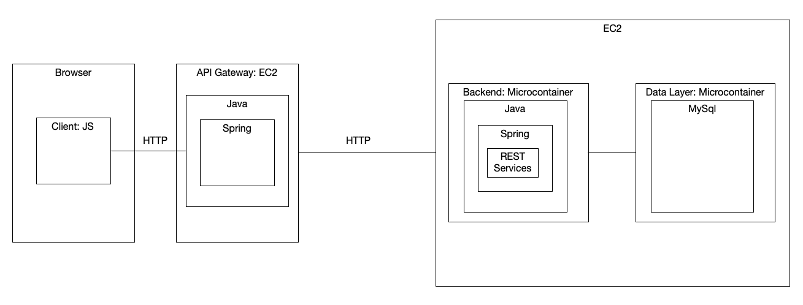

# AYGO-LAB01
Workshop on Introduction to Virtualization and Distributed Programming

## Arquitectura propuesta 


### Front-End (Cliente)
- Una aplicación de JavaScript que proporciona un formulario simple con un campo de entrada para que los usuarios ingresen su nombre y un botón de "Enviar".
- El front-end enviará solicitudes de manera asíncrona (AJAX) al backend, permitiendo a los usuarios registrar su nombre y la hora de su llegada sin recargar la página.
- El formulario capturará la entrada del nombre y desencadenará una solicitud HTTP POST al servicio backend a través de la puerta de enlace API.

### Backend Facade (API Gateway)
- Una aplicación Spring Boot que actúa como la puerta de enlace API, desplegada en una instancia EC2 independiente.
- Este componente gestionará y dirigirá las solicitudes entrantes desde el cliente. Recibirá solicitudes POST del front-end, las validará y luego las enviará al servicio backend monolítico.

### Backend Concreto (Monolito)
- Una aplicación monolítica implementada en Java y desplegada utilizando Docker. Manejará la lógica de negocio, como el registro del nombre y la marca de tiempo de cada registro, así como la recuperación de la lista de llegadas registradas.
- El monolito interactuará con una base de datos MongoDB (corriendo en un contenedor Docker separado) para almacenar y recuperar registros de llegadas.
- El backend expondrá endpoints RESTful para que la puerta de enlace API interactúe, manejando operaciones como la creación de nuevos registros (POST) y la recuperación de la lista de llegadas (GET).

### Base de Datos Documental (MongoDB)
- Una instancia de MongoDB corriendo en un contenedor Docker separado dentro de la misma instancia EC2 que el monolito.
- La base de datos contendrá una colección para almacenar documentos que representan cada registro de llegada, incluyendo campos para ID, nombre y marca de tiempo.
- La aplicación monolítica utilizará esta base de datos para persistir y gestionar los datos de llegada.

### Detalles de Despliegue
- **Instancias EC2:** La puerta de enlace API Spring Boot y el monolito basado en Docker (junto con la base de datos MongoDB) se desplegarán en dos instancias EC2 independientes para aislamiento y escalabilidad.
- **Contenedores Docker:** La aplicación monolítica y la base de datos MongoDB correrán en contenedores Docker separados dentro de la misma instancia EC2.
- **Comunicación:** La puerta de enlace API Spring manejará la comunicación entre el front-end y el monolito. El monolito interactuará con la base de datos MongoDB para almacenar y recuperar datos de llegada.

## Requisitos y Entregables
- **Repositorio en GitHub:** Incluir todo el código fuente, archivos de configuración y scripts de configuración de Docker necesarios para el despliegue.
- **Documentación:** Un archivo README detallado que explique la arquitectura, el proceso de configuración, los pasos de despliegue y las instrucciones para probar y generar imágenes de despliegue, incluyendo capturas de pantalla y registros.
- **Demostración en Video:** Un video corto (5-10 minutos) que demuestre el proceso de despliegue y la funcionalidad de la aplicación, mostrando tanto el registro de nombres como la recuperación de la lista de llegadas.


## Desarrollo

### Comandos para ejecutar la aplicacion 

### Windows


```bash
java -cp "target/classes;target/dependency/*" com.escuelaing.edu.co.distribuited_systems.DistribuitedSystemsApplication
```

### Linux

```bash
java -cp "target/classes:target/dependency/*" com.escuelaing.edu.co.distribuited_systems.DistribuitedSystemsApplication
```

Usando la herramienta de línea de comandos de Docker construya la imagen:
### Comandos Docker

```bash 
docker build --tag docker-hello-image .
```

iniciando contenedor
```bash
docker run -d -p 34000:33025 --name firstdockercontainer docker-hello-image
```
